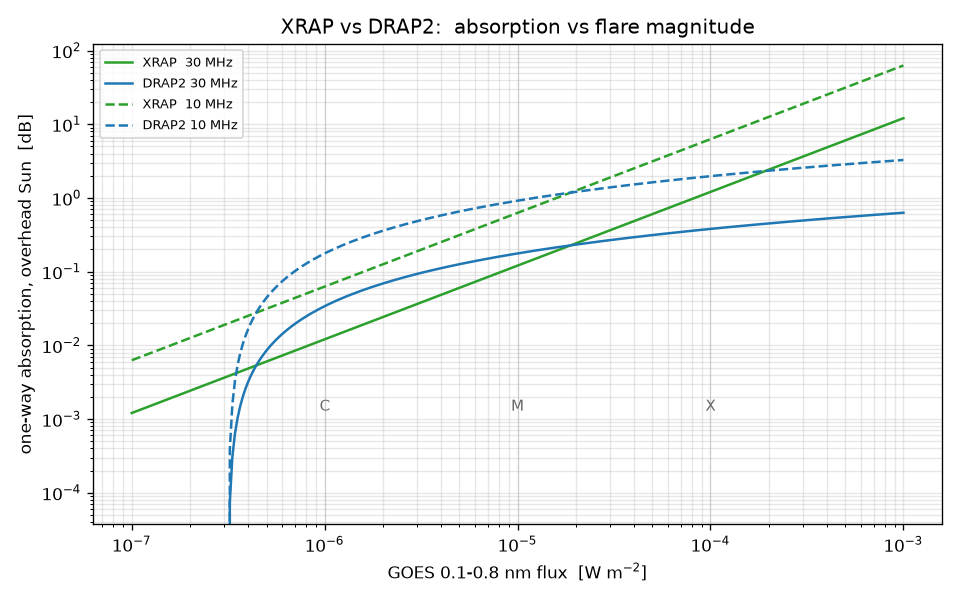
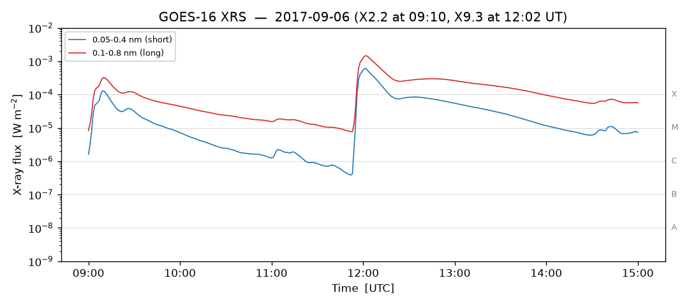
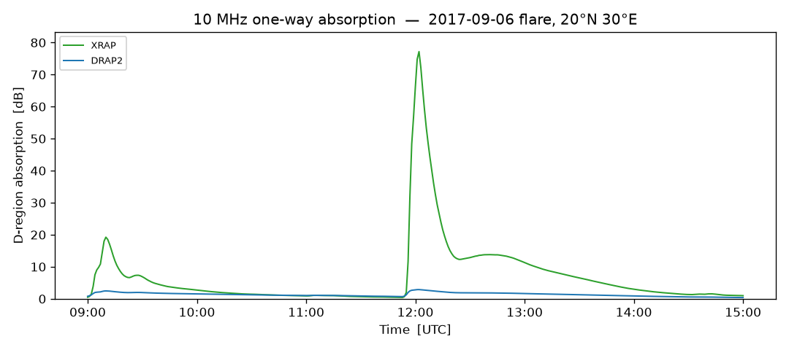
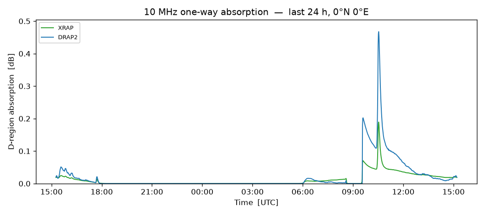

# XRAP model notes

Common inputs: `phi` = GOES 0.1-0.8 nm flux (W m^-2), `chi` = solar zenith angle
at the absorbing point (deg), `f` = HF frequency (MHz). Both models return
**one-way** vertical absorption; `path="total"` doubles it. `A >= 0`.

`absorption(f, chi, phi, model="xrap"|"drap2", ...)` dispatches;
`AbsorptionModel(model=...)` and `xrap predict --model ...` follow.

## "xrap" — Fiori, Chakraborty & Nikitina (2022)   [IMPLEMENTED, DEFAULT]

doi:10.1016/j.jastp.2022.105843 — data-optimized fit to the NRCan 30 MHz
riometer network.

    A(f0) = C * phi^p_I * g(chi)^p_c        # dB, one-way, f0 = 30 MHz
    A(f)  = (f0 / f)^n * A(f0)

`C = 12080`, `p_I = 1`, `p_c = 1`, `n = 1.5` (Hargreaves; Parthasarathy et al.
1963). `reference_absorption(chi, phi)` returns `A(f0)`. The exponents are in
`src/xrap/data/xrap.json` (`scale`, `flux_exponent`, `cos_exponent`, `f0_mhz`,
`freq_exponent`) so the paper's optimized coefficient sets drop in via
`coeffs=`.

## "drap2" — NOAA Global D-Region Absorption Prediction v2   [IMPLEMENTED]

https://www.spaceweather.gov/content/global-d-region-absorption-prediction-documentation

    HAF0      = a * log10(phi) + b          # MHz, sub-solar   (a = 10, b = 65)
    HAF(chi)  = HAF0 * (cos chi)^p          # p = 0.75; 0 for chi >= 90 deg
    A(f,chi)  = 0.5 * A_ref * (HAF(chi) / f)^n   # dB, one-way  (n = 1.5, A_ref = 1 dB)

`highest_affected_frequency(phi, chi)` returns `HAF(chi)`. Coefficients in
`src/xrap/data/drap2.json` (`haf_threshold_db = 10.0` for the polar-map HAF
definition).

## Model comparison — XRAP vs DRAP2

The two models are fit to different data and have different functional forms, so
they diverge — and the divergence depends almost entirely on **flare magnitude**.

### Response to flare size

*One-way absorption, overhead Sun, at 10 and 30 MHz, versus GOES 0.1–0.8 nm
flux. Dashed = 10 MHz, solid = 30 MHz; green = XRAP, blue = DRAP2.*

- **DRAP2 saturates.** Its flux dependence enters as `(a·log10(phi) + b)^1.5`.
  The `log10` compresses the dynamic range badly: going from X1 (10⁻⁴) to X10
  (10⁻³) raises `HAF0` only from 25 → 35 MHz, so absorption grows by just
  `(35/25)^1.5 ≈ 1.6×` for a **10×** increase in flux. There is also a hard
  floor: `HAF0 ≤ 0` (hence `A = 0`) for `phi ≲ 3×10⁻⁷` W m⁻² — the near-vertical
  blue cliff.
- **XRAP is linear in flux** (`A ∝ phi`), a straight line on the log–log plot.

Because both models share the `(f0/f)^1.5` frequency law and a near-identical
`cos χ` dependence, the **XRAP / DRAP2 ratio is essentially frequency- and
SZA-independent — it is a function of flare class**:

| flare | C1 | M1 | ~M2 | M5 | X1 | X10 |
|-------|----|----|-----|----|----|-----|
| XRAP / DRAP2 | 0.36 | 0.68 | **1.0** (crossover) | 1.9 | 3.2 | 19 |

So for weak events (C to ~M2) DRAP2 predicts *more* absorption; above ~M2 XRAP
predicts more, and by X-class DRAP2 is low by a factor of several to ~20×.

### Two real events

The 2017-09-06 **X9.3** flare at 10 MHz: XRAP peaks near **77 dB**, DRAP2 near
**3 dB**. 77 dB is a complete HF blackout — which is exactly what was observed
(HF comms were dead for ~1 h). DRAP2's 3 dB would wrongly imply usable HF
throughout. This is the underestimate Fiori et al. (2022) set out to fix by
refitting to riometer data.

A quiet day of **C-class** flares (0°N 0°E): here the ranking flips — DRAP2
(blue) sits *above* XRAP, consistent with the `C1` column of the table.

### Caveats for XRAP

- `C = 12080` and the linear-in-flux form were fit to **30 MHz** Canadian
  riometers over a limited set of events. Extrapolating far in frequency (the
  `(30/10)^1.5 ≈ 5.2×` step to 10 MHz) or to extreme flares carries real
  uncertainty; the paper reports the *simple* model can also over-predict (~1%
  high for an X2.1 in one event study), and the per-event optimized coefficients
  do better. Drop those in via `coeffs=` / `xrap.json`.
- DRAP2 remains useful as the operational reference and for weak events; keep it
  a call away with `model="drap2"`.

## Zenith-angle handling (`g(chi)` / the `cos chi` taper)

Shared primitive `zenith_factor(chi, exponent=, grazing=, alt_km=90, H_km=7)`:

- `grazing=False` — `max(cos chi, 0)^exponent`, hard zero at `chi = 90 deg`.
- `grazing=True` — `(1 / Ch(X, chi))^exponent` where the layer is sunlit, else 0
  (`xrap.sza.chapman_function`, Smith & Smith 1972). A small positive value
  through 90 deg that decays smoothly to zero at `terminator_sza(alt_km)`
  (~99.6 deg at 90 km); equals `cos chi` below ~80 deg.

`grazing` default: **True for "xrap"** (`cos chi` there is the overhead
ionization-rate factor, for which `1/Ch` is the correct grazing generalization),
**False for "drap2"** (faithful to the published spec). `alt_km = 90`,
`H_km = 7` are hardcoded defaults, overridable per call.

## scale_frequency

`scale_frequency(A0, f0, f, n=None)` — standalone `A(f) = (f0/f)^n * A(f0)`,
`n` defaults to 1.5.

## Oblique-path absorption

`absorption()` is vertical. For a real tx-rx circuit (oblique incidence, 1+
hops), `src/xrap/oblique.py` -- `oblique_absorption(tx, rx, time, freq_mhz,
xray_wm2, n_hops=1, ...)` -- applies the classical secant law (Martyn's
theorem, non-deviative D-region absorption) over every D-region crossing of
the path, each at its own incidence angle and its own SZA. Two independent,
user-selectable choices: `earth_model="curved"|"flat"` (hop geometry) and
`height_model="fixed"|"parabolic"` (F-layer reflection height).

**Full derivation, citations, and a worked/validated example: see
[oblique.md](oblique.md).**

**Caveat:** neither vertical model saturates, so a strong flare on an oblique,
low-elevation multi-hop path can produce absorption in the hundreds to
thousands of dB -- correctly signalling "complete blackout," not a literal,
meaningful link-margin number (no blackout clip is built in). No SNR / link
budget -- this stops at absorption (dB).

## Out of scope

- Solar-energetic-proton / polar-cap term — `polar_cap_absorption()` is a
  documented `NotImplementedError` stub.
- SNR / link budget (FSPL, antenna gain, noise floor) — `oblique_absorption()`
  stops at absorption in dB.
- Full ray tracing (Croft-Hoogasian, magnetoionic splitting, deviative
  absorption) — the secant law + quasi-parabolic layer is the standard
  simplified treatment, not a substitute for a full ray tracer.

## CLI (`src/xrap/cli.py`)  [DONE]

- `xrap predict --lat --lon --freq --start --end` -> absorption CSV (+ `--plot`);
  flags `--model xrap|drap2`, `--grazing/--no-grazing`, `--goes-source`,
  `--satellite`, `--feed`, `--sza-method`, `--path`.
- `xrap fetch-goes --start --end` -> `.nc` (netCDF) or CSV (+ `--plot`); flags
  `--source`, `--satellite`, `--resolution`, `--feed`.

## Plots (`src/xrap/plot.py`)  [DONE]

- `plot_xrs(ds)` — GOES flux, log y, A/B/C/M/X guides.
- `plot_absorption(df, ax=, label=, color=)` — absorption (dB) vs time from
  `AbsorptionModel.predict`; call repeatedly with one `ax` to overlay models
  (a legend appears when any call passes `label=`). The two `network` tests in
  `test_plot.py` overlay `"xrap"` vs `"drap2"` for the 2017-09 flare and the
  last 24 h.

## SZA (`src/xrap/sza.py`)  [IMPLEMENTED]

- `method="noaa"` (default) — analytic NOAA low-precision, vectorised.
- `method="astropy"` — full ephemeris; honours `alt_km` + `refraction`.
- Height helpers for grazing: `horizon_dip`, `terminator_sza`, `is_sunlit`,
  `chapman_function`.
- Open question: sub-ionospheric (ray-piercing) point vs. ground point.

## GOES retrieval (`src/xrap/goes.py`)

- `sunpy` [DONE] — `Fido` + `a.Instrument.xrs` + `a.Resolution("avg1m"|"flx1s")`
  + optional `a.goes.SatelliteNumber`; loads via `TimeSeries`, columns
  `xrsa`/`xrsb` (+ `*_quality`). Newest satellite chosen if unspecified.
  Science data ~2010 -> present.
- `noaa_json` [DONE] — `services.swpc.noaa.gov/json/goes/{primary,secondary}/`;
  reads **`observed_flux`** for both bands from the narrowest `xrays-*` feed
  covering the request, or an explicit `feed="6-hour"|"1-day"|"3-day"|"7-day"`
  (then `start`/`end` are optional). `fetch_goes_flares()` reads
  `xray-flares-{7-day,latest}.json`. <= 7 days only.
- `xrap.plot.plot_xrs(ds)` [DONE] — flux (log y) vs time, A/B/C/M/X guide lines;
  covered by `test_plot.py` (synthetic offline + 2017-09 flare & last-24 h
  `network` tests).
- `netcdf_url` [TODO] — NOAA NCEI GOES science-data netCDF for pre-2010 events.
- `local` [TODO] — user-supplied file per event.

Live routes are covered by `@pytest.mark.network` tests (`pytest --run-network`);
the default suite mocks `xrap.goes._get_json`.

## Figures

The plots in this document are regenerated by `docs/make_figures.py` (needs
network + matplotlib) into `docs/images/`. The "last 24 h" panels change each
run. [oblique.md](oblique.md)'s figure is regenerated separately by
`docs/make_oblique_figures.py`.
