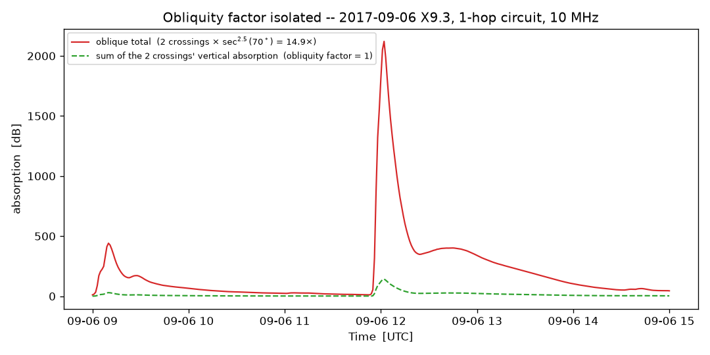

# Oblique-path (multi-hop) HF absorption

`xrap.absorption.absorption()` gives **vertical** D-region absorption at a
single sub-ionospheric point. A real HF circuit is oblique: the wave leaves
the transmitter at some elevation angle, is bent back by the F layer one or
more hops later, and crosses the D region **twice per hop** (up, then down),
generally at different locations. `src/xrap/oblique.py` extends the vertical
models to that geometry using the classical **secant law**. This note derives
the equations it implements and validates them against the code.

## 1. The secant law for non-deviative absorption

D-region absorption is *non-deviative*: the plasma density there is far below
the level needed to bend the ray noticeably, so the wave passes through
essentially in a straight line, and the absorption coefficient depends on the
local electron-neutral collision frequency and the wave's refractive index,
which (away from the gyrofrequency) depends on frequency only through
`f`, not on incidence angle directly [Davies, 1990, Ch. 3; Hargreaves, 1992,
Ch. 4]. Two classical results combine to give the obliquity correction:

**(a) Path-length secant.** For a plane-stratified absorbing layer, a ray
crossing it at angle `chi` from vertical travels `sec(chi)` times the vertical
path length, so accumulates `sec(chi)` times the vertical absorption *at the
same frequency*.

**(b) Martyn's equivalence theorem** [Martyn, 1935]. An oblique wave of
frequency `f` incident on the ionosphere at angle `chi` interacts with the
layer exactly as a **vertical** wave of the *equivalent vertical frequency*
`f' = f * cos(chi)` would (this is also the basis of the classical MUF secant
law, `MUF = foF2 * sec(chi)`, and is discussed at length in Davies [1990,
Ch. 3] and reproduced in the ITU-R HF prediction background material
[ITU-R P.533]).

Combining (a) and (b), the oblique absorption at frequency `f` and incidence
`chi` is

    L_oblique(f, chi) = sec(chi) * L_vertical(f * cos(chi))                 (1)

Both models bundled in XRAP have `L_vertical(f) ~ f**-n` with `n = 1.5`
(`freq_exponent`; see [model.md](model.md) -- traced to Hargreaves' reading of
Parthasarathy et al. [1963] for XRAP, and to the same exponent in NOAA DRAP2).
Substituting:

    L_vertical(f * cos chi) = (f * cos chi)**-n * k = L_vertical(f) * sec(chi)**n

    L_oblique(f, chi) = sec(chi)**(n + 1) * L_vertical(f)                   (2)

`obliquity_factor(chi, n=1.5)` implements `sec(chi)**(n+1)` -- equation (2).
The total absorption along a real path sums this over **every** D-region
crossing (`hop_crossings`), each evaluated at *its own* incidence angle *and*
its own solar zenith angle (via `solar_zenith_angle`, since different
crossings can be at very different latitudes/local times):

    L_total = sum_i  sec(chi_i)**(n+1) * L_vertical(f, SZA_i, flux)         (3)

## 2. Geometry: incidence angle from ground range and reflection height

Given a hop of ground range `d` reflecting at virtual height `h`, we need the
incidence angle `chi` the ray makes with the vertical at the reflection point
(and, under the approximation in §3, at the D-region crossing too).

**Curved earth.** Put the Earth's center at the origin, the transmitter at
radius `R`, and the reflection point `M` at radius `R + h`, angularly
`delta = d / (2R)` away (half the hop, in radians, `R` = mean Earth radius).
Because the ray is a straight line in vacuum between TX and `M`, **Bouguer's
theorem** for a spherically symmetric medium (`n(r) r sin(theta(r)) =
const`, here `n = 1`) [Budden, 1961; Davies, 1990] gives, evaluated at the
transmitter (`r = R`, angle from the local vertical `= 90 deg - beta`, `beta`
= elevation angle) and at `M` (`r = R+h`, angle from local vertical `= chi`):

    R * cos(beta) = (R + h) * sin(chi)
    =>  sin(chi) = [R / (R + h)] * cos(beta)                                (4)

`beta` itself follows from the plane geometry of triangle (Earth
center)-(TX)-(M) (place TX at angle 0 and `M` at angle `delta`, both measured
from the Earth's center; the ray direction relative to the local horizontal
at TX, resolved along the local vertical/horizontal axes, gives):

    tan(beta) = [cos(delta) - R/(R + h)] / sin(delta)                       (5)

`incidence_angle(ground_range_km, height_km, earth_model="curved")` implements
(4)-(5). This is the standard curved-earth secant-law pair used for MUF/hop
geometry [Davies, 1990, Ch. 3].

**Flat earth.** For a straight line from the ground to an apex at
`(d/2, h)`, elementary trigonometry gives

    tan(beta) = 2h / d,      chi = 90 deg - beta                            (6)

`earth_model="flat"` implements (6) -- fine for short/medium ranges, no
pole/date-line handling.

**Consistency check.** Equations (4)-(5) reduce to (6) in the flat-earth limit
`R -> infinity` (expand `cos(delta) approx 1 - delta**2/2`,
`sin(delta) approx delta` with `delta = d/(2R)`; the code's test suite checks
this numerically for short hops).

## 3. Locating the D-region crossings

A hop's ray crosses the D region (`alt_km`, default 90 km) twice: once on the
way up, once on the way down -- each at a different point, hence a different
solar zenith angle. Under the straight-line-to-apex geometry of §2, the
incidence angle is the **same everywhere along that line** (it's straight), so
the ascending crossing sits at the fraction `alt_km / h` of the way from the
hop's start to its apex, and the descending crossing is the mirror image
near the hop's end:

    up_range   = (d/2) * (alt_km / h)
    down_range = d - up_range

This is **exact** under `earth_model="flat"` and an **approximation** under
`"curved"` -- a reasonable one, since the D region (~90 km) sits well below a
typical F-layer reflection height (~250-350 km), so the great-circle curvature
accumulated over that short a rise is small. `hop_crossings()` implements
this, then converts the ground-range fraction to a (lat, lon) via great-circle
(or linear, for `"flat"`) interpolation between the transmitter and receiver.

For `n_hops` hops, the path is split into `n_hops` equal ground-range hops,
each with its own reflection apex, giving `2 * n_hops` total crossings.

## 4. Reflection height: fixed vs. quasi-parabolic

`incidence_angle` needs a reflection height `h`. Two models, both
user-selectable via `height_model=`:

**`"fixed"`** -- a single scalar `height_km`, independent of frequency. Fast,
simple, and the honest choice when you don't have (or don't want to assume) a
real ionogram.

**`"parabolic"`** -- an idealized quasi-parabolic (QP) F2 layer [Croft &
Hoogasian, 1968]:

    f_N(r)**2 = foF2**2 * [1 - ((r - r_m) / y_m)**2]                        (7)

(`r_m = R + hmF2`, `y_m = ym_km`), truncated to the range where the bracket is
non-negative. For a **vertical** wave, the reflection height solves (7) at
`f_N = f` directly:

    h_vertical(f) = hmF2 - ym * sqrt(1 - (f / foF2)**2)                     (8)

For an **oblique** wave at incidence `chi`, Martyn's theorem (§1) says it
behaves like a vertical wave at `f' = f * cos(chi)` -- but `chi` itself depends
on the (unknown) reflection height `h` via (4)-(5). `reflection_height()`
solves this self-consistently by fixed-point iteration: guess `h` (seeded at
`hmF2`), get `chi` from (4)-(5), get `f' = f cos(chi)` from Martyn's theorem,
get a new `h` from (8) with `f'` in place of `f`, and repeat to convergence
(typically a handful of iterations). Since `f' <= f` always (`cos <= 1`), and
the pre-check `f > foF2` raises immediately, `f'` can never exceed `foF2`
during the iteration -- obliquity only ever *helps* reflection, consistent
with the textbook fact that the oblique MUF, `foF2 * sec(chi)`, always exceeds
the vertical critical frequency.

**Not implemented:** this is the standard *secant-law-with-a-QP-layer*
simplification, not full analytic QP ray tracing [Croft & Hoogasian, 1968],
which additionally accounts for the ray's curved path inside the layer
(deviative effects, magnetoionic O/X splitting). For non-deviative D-region
absorption at HF, the simplification here is the commonly used one; it
introduces error mainly very close to the MUF.

## 5. Worked example / validation

A single hop, ~2200 km (roughly southern Greece to north-eastern France),
10 MHz, `height_model="fixed"`, `height_km=300`, during the 2017-09-06 X9.3
flare:

```
up    lat=37.15  lon=22.48   ground_range=  329.0 km   incidence=70.14 deg
down  lat=46.29  lon= 8.56   ground_range=1864.5 km   incidence=70.14 deg
```

Both crossings share one incidence angle (same hop, same straight-line
trajectory -- §2-3), so `sec(70.14 deg)**2.5 = 14.87` should relate the
oblique total to the sum of the two crossings' *vertical* absorption
(obliquity factor stripped out) at every instant. Regenerate with
`python docs/make_oblique_figures.py` (needs network):



At the flux peak (2017-09-06 12:02 UT, GOES-16 `xrsb` = 1.46e-3 W/m^2):

| quantity | value |
|---|---|
| incidence (both crossings) | 70.14 deg |
| `sec(70.14 deg)**2.5` (eq. 2, predicted) | 14.868 |
| vertical absorption, "up" crossing (chi=37.54 deg) | 72.87 dB |
| vertical absorption, "down" crossing (chi=40.86 deg) | 69.50 dB |
| sum of the two (green curve) | 142.37 dB |
| oblique total (red curve, eq. 3) | 2120.67 dB |
| **measured ratio** | **14.895** |

Matches the analytic prediction to **0.2%** -- the small residual is normal
floating-point/iteration tolerance, not a modeling gap.

**Reading the numbers:** 2120 dB is not meant to be read as a literal link
budget figure -- it is far beyond any circuit being usable at all. It
correctly signals "complete blackout" for an X9-class flare on a long,
low-elevation path; see the caveat in [model.md](model.md#oblique-path-absorption).

## 6. Scope

Implemented: non-deviative D-region absorption via the secant law (eq. 2-3),
flat- or curved-earth hop/crossing geometry (§2-3), fixed or quasi-parabolic
reflection height (§4).

Not implemented (see also [model.md](model.md)): SNR / link budget (free-space
path loss, antenna gain, noise floor); full ray tracing (deviative absorption,
magnetoionic O/X mode splitting, exact Croft-Hoogasian QP solutions); a
saturation/blackout clip on the returned dB value.

## References

1. Davies, K. (1990). *Ionospheric Radio*. IEE Electromagnetic Waves Series 31.
   Peter Peregrinus Ltd / IET. -- standard reference for the secant law,
   non-deviative absorption, and MUF/hop geometry (Ch. 3).
2. Martyn, D. F. (1935). The propagation of medium radio waves in the
   ionosphere. *Proceedings of the Physical Society*, 47(2), 323-339. --
   original oblique/vertical equivalence theorem underlying the secant law.
3. Budden, K. G. (1961). *Radio Waves in the Ionosphere*. Cambridge University
   Press. -- Bouguer's theorem / ray invariant for spherically stratified
   media, used in the curved-earth geometry derivation (eq. 4).
4. Hargreaves, J. K. (1992). *The Solar-Terrestrial Environment*. Cambridge
   University Press. -- D-region absorption frequency dependence and
   non-deviative absorption background.
5. Croft, T. A., & Hoogasian, H. (1968). Exact ray calculations in a
   quasi-parabolic ionosphere. *Radio Science*, 3(1), 69-74. --
   quasi-parabolic layer model (eq. 7); this module uses the simplified
   secant-law version, not the full ray-tracing solution given there.
6. ITU-R Recommendation P.533. *Method for the prediction of the performance
   of HF circuits*. International Telecommunication Union. -- operational
   background on secant-law/MUF geometry for HF circuit prediction.
7. Parthasarathy, R., Lerfald, G. M., & Little, C. G. (1963). Derivation of
   electron-density profiles in the lower ionosphere using radio absorption
   measurements at multiple frequencies. *Journal of Geophysical Research*,
   68(12), 3581-3588. -- multi-frequency absorption measurements behind the
   `n = 1.5` frequency exponent shared by both bundled vertical models (see
   [model.md](model.md)).
8. Fiori, R. A. D., Chakraborty, S., & Nikitina, L. (2022). Data-based
   optimization of a simple shortwave fadeout absorption model. *Journal of
   Atmospheric and Solar-Terrestrial Physics*, 230, 105843.
   [doi:10.1016/j.jastp.2022.105843](https://doi.org/10.1016/j.jastp.2022.105843)
